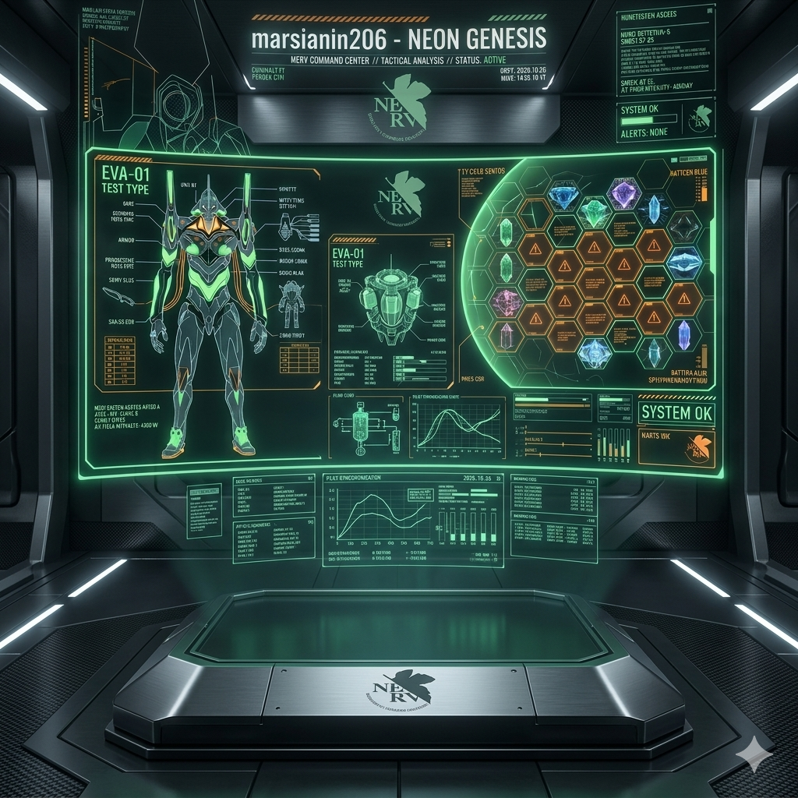
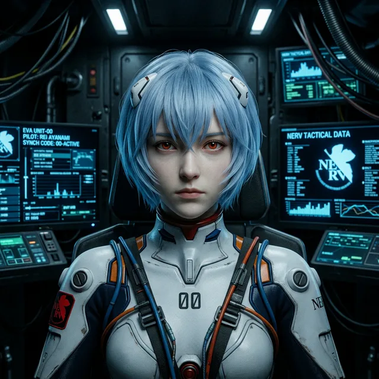
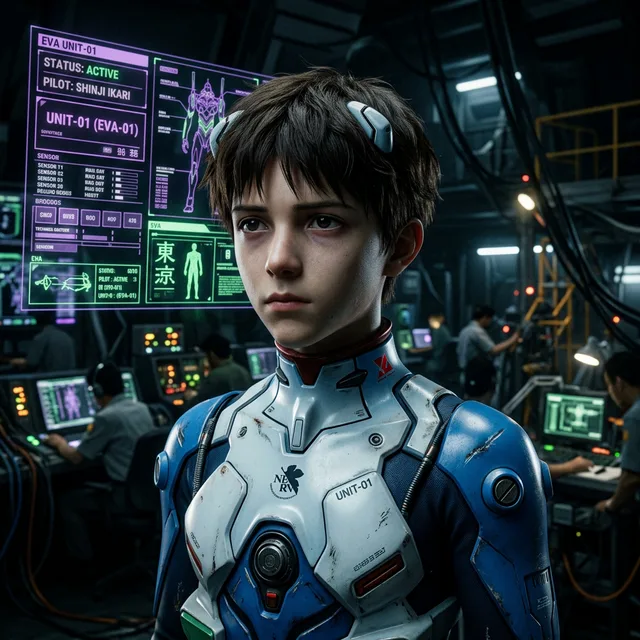
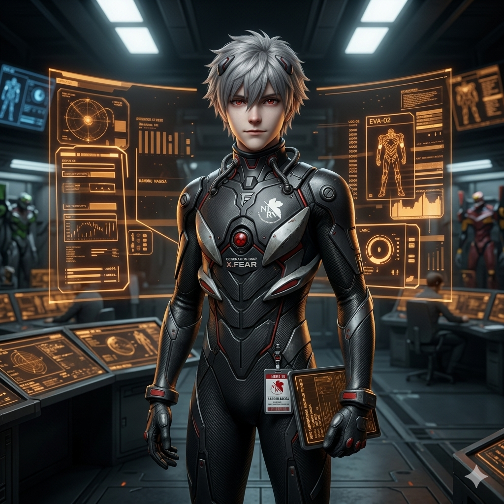
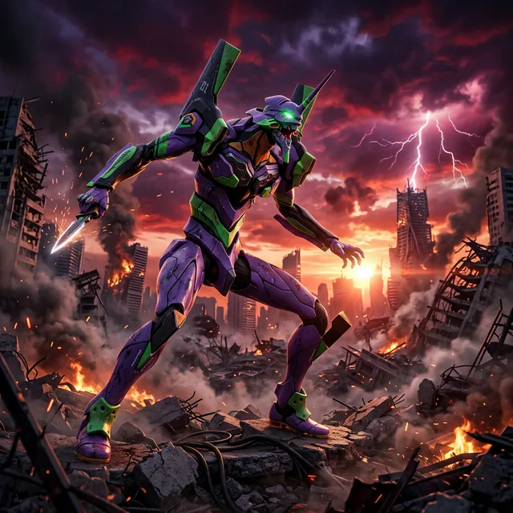

<!-- ═══════════════════════════════════════════════════════════════════════════ -->
<!--                                                                           -->
<!--           NERV CENTRAL COMMAND • TOP SECRET • ACCESS RESTRICTED           -->
<!--           PROJECT E • HUMAN INSTRUMENTALITY PROJECT • v6.2.0              -->
<!--                                                                           -->
<!-- ═══════════════════════════════════════════════════════════════════════════ -->

  

  

<!-- ════════════════════ 🛡️ BIO-METRIC IDENTIFICATION 🛡️ ════════════════════ -->

<svg width="600" height="120" viewBox="0 0 600 120" xmlns="http://www.w3.org/2000/svg">
<rect width="600" height="120" fill="#0d0d0d" stroke="#ff6b35" stroke-width="2" rx="10"/>
<text x="20" y="30" fill="#ff6b35" font-family="monospace" font-size="14" font-weight="bold">SCANNING BIOMETRICS...</text>
<path d="M100 80 Q 110 40 120 80 T 140 80 T 160 80 T 180 80 T 200 80" fill="none" stroke="#50c878" stroke-width="2">
<animate attributeName="d" values="M100 80 Q 110 40 120 80 T 140 80 T 160 80 T 180 80 T 200 80; M100 80 Q 110 120 120 80 T 140 80 T 160 80 T 180 80 T 200 80; M100 80 Q 110 40 120 80 T 140 80 T 160 80 T 180 80 T 200 80" dur="1s" repeatCount="indefinite" />
</path>
<rect x="250" y="45" width="300" height="20" fill="none" stroke="#ff6b35" stroke-width="1"/>
<rect x="255" y="50" width="0" height="10" fill="#ff6b35">
<animate attributeName="width" from="0" to="290" dur="3s" repeatCount="indefinite" />
</rect>
<text x="400" y="95" fill="#50c878" font-family="monospace" font-size="18" font-weight="bold" text-anchor="middle">
<tspan>ACCESS GRANTED: PILOT [marsianin206]</tspan>
<animate attributeName="opacity" values="1;0.2;1" dur="1.5s" repeatCount="indefinite" />
</text>
</svg>

  

 

<!-- ════════════════════ 📡 TERMINAL V2.0 FEATURES 📡 ════════════════════ -->

<h2 align="center">📡 NERV COMMAND TERMINAL v6.2.0 | ИНТЕРАКТИВНЫЕ ФУНКЦИИ 📡</h2>

  <table>
    <tr>
      <td><b>📟 BOOT SEQUENCE</b></td>
      <td>Симуляция запуска системы MAGI с логами дешифровки</td>
    </tr>
    <tr>
      <td><b>📏 DEPTH METER</b></td>
      <td>Отслеживание спуска в Терминальную Догму (до 1500м) при скроллинге</td>
    </tr>
    <tr>
      <td><b>🎮 A-T FIELD DEFENSE</b></td>
      <td>Интерактивная мини-игра по защите ядра базы от атак Ангелов</td>
    </tr>
    <tr>
      <td><b>📈 BIO-ACTIVITY GRID</b></td>
      <td>Кастомная карта активности GitHub, стилизованная под биологический лог</td>
    </tr>
    <tr>
      <td><b>🎧 SDAT-2026 PLAYER</b></td>
      <td>Продвинутый музыкальный плеер с выбором тактических треков</td>
    </tr>
    <tr>
      <td><b>🧪 LCL INTERFACE</b></td>
      <td>Режим погружения с анимированными частицами LCL и эффектами глитча</td>
    </tr>
    <tr>
      <td><b>👤 DOSSIER ACCESS</b></td>
      <td>Интерактивные карточки пилотов с расширяемой статистикой синхронизации</td>
    </tr>
  </table>

 

<!-- ════════════════════ 🧠 MAGI SUPERCOMPUTER VOTING 🧠 ════════════════════ -->

<h3 align="center">🧠 MAGI SYSTEM DECISION | РЕШЕНИЕ СИСТЕМЫ МАГИ 🧠</h3>

<table border="0">
<tr>
<td align="center">
<svg width="150" height="100" viewBox="0 0 150 100" xmlns="http://www.w3.org/2000/svg">
<rect width="150" height="100" fill="#0d0d0d" stroke="#ff6b35" stroke-width="2"/>
<text x="75" y="30" fill="#ff6b35" font-family="monospace" font-size="12" text-anchor="middle">MELCHIOR-1</text>
<rect x="25" y="45" width="100" height="30" fill="#50c878">
<animate attributeName="opacity" values="1;0.3;1" dur="2s" repeatCount="indefinite" />
</rect>
<text x="75" y="65" fill="#0d0d0d" font-family="monospace" font-size="16" font-weight="bold" text-anchor="middle">PRIORITY</text>
</svg>
</td>
<td align="center">
<svg width="150" height="100" viewBox="0 0 150 100" xmlns="http://www.w3.org/2000/svg">
<rect width="150" height="100" fill="#0d0d0d" stroke="#ff6b35" stroke-width="2"/>
<text x="75" y="30" fill="#ff6b35" font-family="monospace" font-size="12" text-anchor="middle">BALTHASAR-2</text>
<rect x="25" y="45" width="100" height="30" fill="#50c878">
<animate attributeName="opacity" values="1;0.3;1" dur="2.5s" repeatCount="indefinite" />
</rect>
<text x="75" y="65" fill="#0d0d0d" font-family="monospace" font-size="16" font-weight="bold" text-anchor="middle">YES</text>
</svg>
</td>
<td align="center">
<svg width="150" height="100" viewBox="0 0 150 100" xmlns="http://www.w3.org/2000/svg">
<rect width="150" height="100" fill="#0d0d0d" stroke="#ff6b35" stroke-width="2"/>
<text x="75" y="30" fill="#ff6b35" font-family="monospace" font-size="12" text-anchor="middle">CASPER-3</text>
<rect x="25" y="45" width="100" height="30" fill="#50c878">
<animate attributeName="opacity" values="1;0.3;1" dur="1.5s" repeatCount="indefinite" />
</rect>
<text x="75" y="65" fill="#0d0d0d" font-family="monospace" font-size="16" font-weight="bold" text-anchor="middle">YES</text>
</svg>
</td>
</tr>
</table>

 

<!-- ════════════════════ 🎬 TECHNICAL HUD SEQUENCES 🎬 ════════════════════ -->

  <table border="0">
    <tr>
      <td width="48%" align="center">
        <svg width="300" height="180" viewBox="0 0 300 180" xmlns="http://www.w3.org/2000/svg">
          <rect width="300" height="180" fill="#0d0d0d" stroke="#ff6b35" stroke-width="2"/>
          <rect width="300" height="25" fill="#ff6b35"/>
          <text x="10" y="17" fill="#0d0d0d" font-family="monospace" font-size="12" font-weight="bold">SYSTEM: EVA-01</text>
          <text x="150" y="70" fill="#ff6b35" font-family="monospace" font-size="13" font-weight="bold" text-anchor="middle">ПОСЛЕДОВАТЕЛЬНОСТЬ</text>
          <text x="150" y="90" fill="#ff6b35" font-family="monospace" font-size="13" font-weight="bold" text-anchor="middle">АКТИВАЦИИ ЕВА-БЛОКА 01</text>
          <rect x="30" y="120" width="240" height="15" fill="none" stroke="#ff6b35" stroke-width="1"/>
          <rect x="35" y="125" width="230" height="5" fill="#ff6b35">
            <animate attributeName="width" from="0" to="230" dur="4s" repeatCount="indefinite" />
          </rect>
          <text x="150" y="155" fill="#ff6b35" font-family="monospace" font-size="12" text-anchor="middle">
            <tspan>INITIALIZING PHASE...</tspan>
            <animate attributeName="opacity" values="1;0;1" dur="1s" repeatCount="indefinite" />
          </text>
        </svg>
      </td>
      <td width="4%"></td>
      <td width="48%" align="center">
        <svg width="300" height="180" viewBox="0 0 300 180" xmlns="http://www.w3.org/2000/svg">
          <rect width="300" height="180" fill="#0d0d0d" stroke="#50c878" stroke-width="2"/>
          <rect width="300" height="25" fill="#50c878"/>
          <text x="10" y="17" fill="#0d0d0d" font-family="monospace" font-size="12" font-weight="bold">HUD: LCL STATUS</text>
          <text x="150" y="70" fill="#50c878" font-family="monospace" font-size="13" font-weight="bold" text-anchor="middle">ВНУТРЕННЕЕ ДАВЛЕНИЕ</text>
          <text x="150" y="90" fill="#50c878" font-family="monospace" font-size="13" font-weight="bold" text-anchor="middle">LCL СТАБИЛИЗИРОВАНО</text>
          <path d="M40 130 Q 80 110 120 130 T 200 130 T 280 130" fill="none" stroke="#50c878" stroke-width="1">
            <animate attributeName="d" values="M40 130 Q 80 110 120 130 T 200 130 T 280 130; M40 130 Q 80 150 120 130 T 200 130 T 280 130; M40 130 Q 80 110 120 130 T 200 130 T 280 130" dur="3s" repeatCount="indefinite" />
          </path>
          <text x="150" y="155" fill="#50c878" font-family="monospace" font-size="12" text-anchor="middle">SYNC RATE: OPTIMAL</text>
        </svg>
      </td>
    </tr>
  </table>

 

<!-- ════════════════════ 🎧 NERV AUDIO COMMAND CONSOLE 🎧 ════════════════════ -->

  

  <a href="https://open.spotify.com/playlist/37i9dQZF1E8KkUS5Hd4AU0">
    
    &nbsp;
    
    &nbsp;
    
  </a>

 

<!-- ════════════════════ 🃏 NERV CLASSIFIED PILOT DATABASE 🃏 ════════════════════ -->

<h2 align="center">🧬 CLASSIFIED PILOT DATABASE | БАЗА ДАННЫХ ПИЛОТОВ 🧬</h2>

  <table border="0">
    <tr>
      <td align="center" width="25%">
        
         
        
         
        <b>綾波 レイ • EVA-00 PILOT</b>
      </td>
      <td align="center" width="25%">
        
         
        
         
        <b>碇 シンジ • EVA-01 PILOT</b>
      </td>
      <td align="center" width="25%">
        
         
        
         
        <b>惣流・アスカ • EVA-02 PILOT</b>
      </td>
      <td align="center" width="25%">
        
         
        
         
        <b>渚 カヲル • TABRIS</b>
      </td>
    </tr>
  </table>

 

<!-- ════════════════════ 🛡️ SKILL SYNCHRONIZATION MONITOR 🛡️ ════════════════════ -->

<h2 align="center">⚙️ SKILL SYNC MONITOR | МОНИТОР СИНХРОНИЗАЦИИ ⚙️</h2>

| MODULE | SYNCHRONIZATION RATIO | TELEMETRY STATUS |
| :--- | :--- | :--- |
|  |  | `CRITICAL_FLOW / OVERLOADED` |
|  |  | `HARMONIC_PULSE / OPTIMAL` |
|  |  | `CONTAINER_LOCK / SECURE` |
|  |  | `INTEGRITY_LOG / ACTIVE` |

 

<!-- ════════════════════ 📊 STATISTICS (THEMED) 📊 ════════════════════ -->

  <table width="100%">
    <tr>
      <td width="50%">
         
      </td>
      <td width="50%">
        
      </td>
    </tr>
  </table>

 

<!-- ════════════════════ 🐍 CONTRIBUTION ANALYSIS 🐍 ════════════════════ -->

  
  <h2>🐍 CONTRIBUTION PATTERN ANALYSIS 🐍</h2>
   
  <picture>
    <source media="(prefers-color-scheme: dark)" srcset="https://raw.githubusercontent.com/marsianin206/marsianin206/output/github-snake-dark.svg" />
    <source media="(prefers-color-scheme: light)" srcset="https://raw.githubusercontent.com/marsianin206/marsianin206/output/github-snake.svg" />
    
  </picture>

 

<!-- ════════════════════ 🛡️ TACTICAL MISSION LOG 🛡️ ════════════════════ -->

<h2 align="center">🛡️ TACTICAL MISSION LOG | ЖУРНАЛ БОЕВЫХ ОПЕРАЦИЙ 🛡️</h2>

| TARGET | CODE | STATUS | PILOT SYNC | DAMAGE |
| :--- | :---: | :--- | :---: | :---: |
| **SACHIEL** | `03` |  | `41.3%` | `LIGHT` |
| **RAMIEL** | `05` |  | `89.1%` | `CRITICAL` |
| **ZERUEL** | `14` |  | `ERR:%` | `DESTROYED` |
| **TABRIS** | `17` |  | `100%` | `EMOTIONAL` |

 

<!-- ════════════════════ 📂 CLASSIFIED PROJECT DOSSIERS ════════════════════ -->

<h2 align="center">📂 CLASSIFIED PROJECT DOSSIERS | СЕКРЕТНЫЕ МИССИИ 📂</h2>

  <table border="0">
    <tr>
      <td width="50%">
          
         <code>> STATUS: [IN_PROGRESS]</code> 
         <code>> CODE_NAME: "MELCHIOR"</code> 
         <code>> OBJECTIVE: NEURAL NETWORK DEV</code>
      </td>
      <td width="50%">
          
         <code>> STATUS: [COMPLETED]</code> 
         <code>> CODE_NAME: "ADAM"</code> 
         <code>> OBJECTIVE: CLOUD INFRASTRUCTURE</code>
      </td>
    </tr>
  </table>

 

<!-- ════════════════════ 📡 COMMUNICATION 📡 ════════════════════ -->

<h2 align="center">📡 КАНАЛ NERV SECURE / СВЯЗЬ 📡</h2>

  
  &nbsp;&nbsp;
  

 

<h2 align="center">☕️ TIP JAR / SUPPORT | ПОДДЕРЖКА ☕️</h2>

  
<i>If you enjoy my tactical systems, consider supporting EVA maintenance:</i>

  

 

  

 

<!-- ════════════════════ 🎬 FINAL BATTLE 🎬 ════════════════════ -->

  

 

  

<!-- 
═══════════════════════════════════════════════════════════════════
📌 ВАЖНО / IMPORTANT:
1. Загрузи файлы баннеров и портретов в свой репозиторий вместе с README.
═══════════════════════════════════════════════════════════════════
-->

