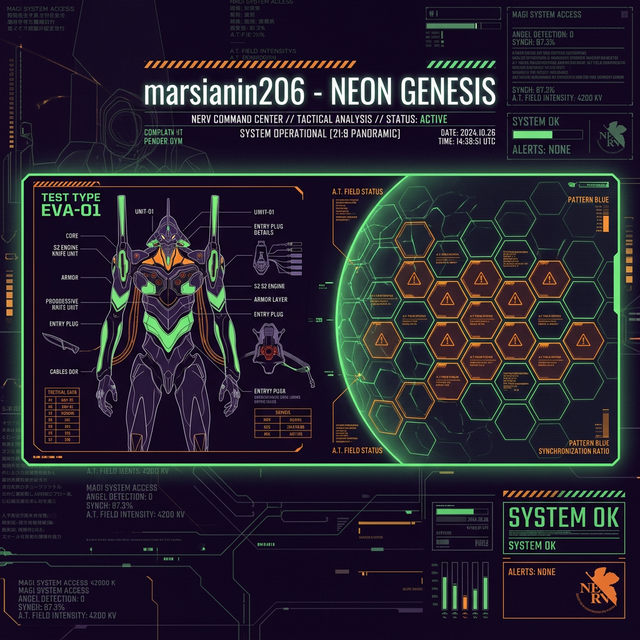
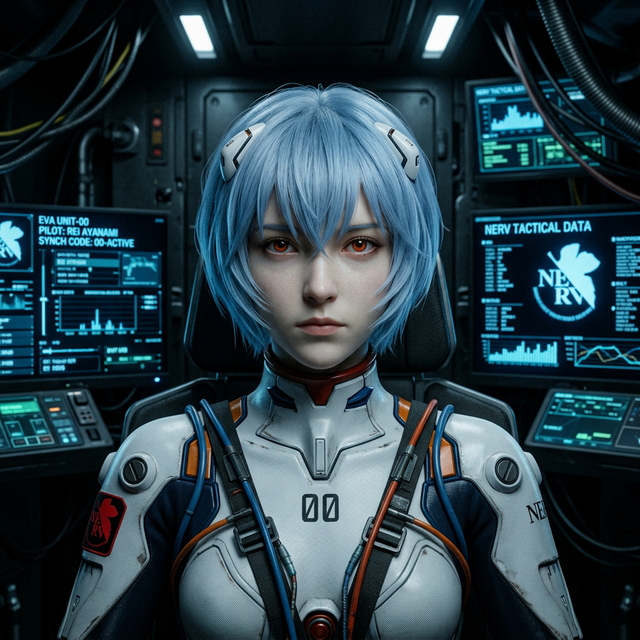
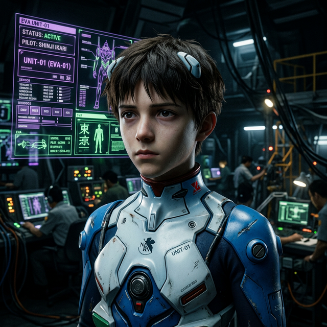
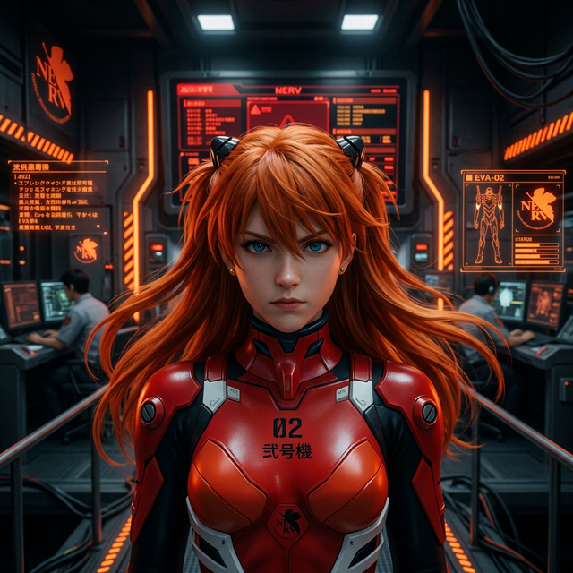
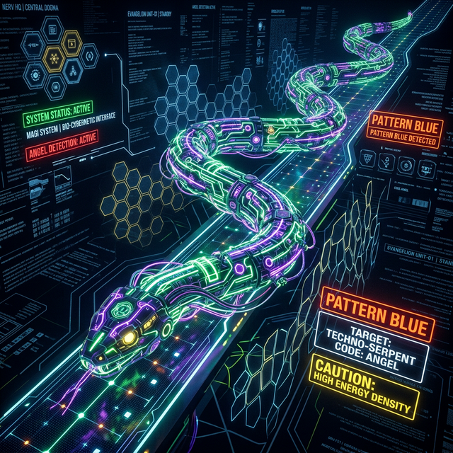

<!-- ═══════════════════════════════════════════════════════════════════════════ -->
<!--                                                                           -->
<!--           NERV CENTRAL COMMAND • TOP SECRET • ACCESS RESTRICTED           -->
<!--           PROJECT E • HUMAN INSTRUMENTALITY PROJECT • v5.0                -->
<!--                                                                           -->
<!-- ═══════════════════════════════════════════════════════════════════════════ -->

<div align="center">
  
</div>

<div align="center">
  
</div>

<br/>

<!-- ════════════════════ ⚠️ EMERGENCY / WARNING ⚠️ ════════════════════ -->

<div align="center">
  
</div>

<br/>

<!-- ════════════════════ 🎬 TECHNICAL HUD SEQUENCES 🎬 ════════════════════ -->

<div align="center">
  <table border="0">
    <tr>
      <td width="48%" align="center">
        <svg width="350" height="200" viewBox="0 0 350 200" xmlns="http://www.w3.org/2000/svg">
          <rect width="350" height="200" fill="#0d0d0d" stroke="#ff6b35" stroke-width="3"/>
          <rect width="350" height="30" fill="#ff6b35"/>
          <text x="10" y="20" fill="#0d0d0d" font-family="monospace" font-size="14" font-weight="900">SYSTEM: EVA-01</text>
          <text x="175" y="85" fill="#ff6b35" font-family="monospace" font-size="16" font-weight="900" text-anchor="middle">ПОСЛЕДОВАТЕЛЬНОСТЬ</text>
          <text x="175" y="110" fill="#ff6b35" font-family="monospace" font-size="16" font-weight="900" text-anchor="middle">АКТИВАЦИИ ЕВА-БЛОКА 01</text>
          <rect x="45" y="145" width="260" height="20" fill="none" stroke="#ff6b35" stroke-width="1.5"/>
          <rect x="50" y="150" width="250" height="10" fill="#ff6b35">
            <animate attributeName="width" from="0" to="250" dur="4s" repeatCount="indefinite" />
          </rect>
          <text x="175" y="185" fill="#ff6b35" font-family="monospace" font-size="12" text-anchor="middle">
            <tspan>INITIALIZING PHASE...</tspan>
            <animate attributeName="opacity" values="1;0;1" dur="1s" repeatCount="indefinite" />
          </text>
        </svg>
      </td>
      <td width="4%"></td>
      <td width="48%" align="center">
        <svg width="350" height="200" viewBox="0 0 350 200" xmlns="http://www.w3.org/2000/svg">
          <rect width="350" height="200" fill="#0d0d0d" stroke="#50c878" stroke-width="3"/>
          <rect width="350" height="30" fill="#50c878"/>
          <text x="10" y="20" fill="#0d0d0d" font-family="monospace" font-size="14" font-weight="900">HUD: LCL STATUS</text>
          <text x="175" y="85" fill="#50c878" font-family="monospace" font-size="16" font-weight="900" text-anchor="middle">ВНУТРЕННЕЕ ДАВЛЕНИЕ</text>
          <text x="175" y="110" fill="#50c878" font-family="monospace" font-size="16" font-weight="900" text-anchor="middle">LCL СТАБИЛИЗИРОВАНО</text>
          <path d="M50 155 Q 100 135 150 155 T 250 155 T 350 155" fill="none" stroke="#50c878" stroke-width="1.5">
            <animate attributeName="d" values="M50 155 Q 100 135 150 155 T 250 155 T 350 155; M50 155 Q 100 175 150 155 T 250 155 T 350 155; M50 155 Q 100 135 150 155 T 250 155 T 350 155" dur="3s" repeatCount="indefinite" />
          </path>
          <text x="175" y="185" fill="#50c878" font-family="monospace" font-size="12" text-anchor="middle">SYNC RATE: OPTIMAL</text>
        </svg>
      </td>
    </tr>
  </table>
</div>

<br/>

<!-- ════════════════════ 🧬 NERV PILOT DATABASE 🧬 ════════════════════ -->

<h2 align="center">
   ◈ NERV CLASSIFIED ARCHIVE ◈ 
</h2>

<div align="center">

```text
╔══════════════════════════════════════════════════════════════════╗
║                                                                  ║
║   ██████╗ ███████╗ █████╗ ██████╗       ███╗   ███╗███████╗      ║
║   ██╔══██╗██╔════╝██╔══██╗██╔══██╗      ████╗ ████║██╔════╝      ║
║   ██████╔╝█████╗  ███████║██║  ██║      ██╔████╔██║███████╗      ║
║   ██╔══██╗██╔══╝  ██╔══██║██║  ██║      ██║╚██╔╝██║╚════██║      ║
║   ██║  ██║███████╗██║  ██║██████╔╝      ██║ ╚═╝ ██║███████║      ║
║   ╚═╝  ╚═╝╚══════╝╚═╝  ╚═╝╚═════╝       ╚═╝     ╚═╝╚══════╝      ║
║                                                                  ║
║   > IDENTIFICATION: PILOT marsianin206                           ║
║   > ASSIGNMENT: NERV CENTRAL DOGMA / TECH OPS                    ║
║   > SYNC LIMITS: REMOVED (BERSERK MODE CAPABLE)                  ║
║                                                                  ║
╚══════════════════════════════════════════════════════════════════╝
```

</div>

<br/>

<!-- ════════════════════ 🃏 NERV CLASSIFIED PILOT DATABASE 🃏 ════════════════════ -->

<h2 align="center">🧬 CLASSIFIED PILOT DATABASE | БАЗА ДАННЫХ ПИЛОТОВ 🧬</h2>

<div align="center">
  <table border="0">
    <tr>
      <td align="center" width="33%">
        
        <br/>
        
        <br/>
        <sub><b>綾波 レイ • EVA-00 PILOT</b></sub>
      </td>
      <td align="center" width="33%">
        
        <br/>
        
        <br/>
        <sub><b>碇 シンジ • EVA-01 PILOT</b></sub>
      </td>
      <td align="center" width="33%">
        
        <br/>
        
        <br/>
        <sub><b>惣流・アスカ • EVA-02 PILOT</b></sub>
      </td>
    </tr>
  </table>
</div>

<br/>

<!-- ════════════════════ 🛠️ TECH STACK 🛠️ ════════════════════ -->

<h2 align="center">⚡ TECHNICAL SPECIFICATIONS | ТЕХОСНАЩЕНИЕ ⚡</h2>

<div align="center">
  
</div>

<br/>

<!-- ════════════════════ 📊 STATISTICS (THEMED) 📊 ════════════════════ -->

<div align="center">
  <table width="100%">
    <tr>
      <td width="50%">
         
      </td>
      <td width="50%">
        
      </td>
    </tr>
  </table>
</div>

<br/>

<!-- ════════════════════ 🐍 Змея-покровитель 🐍 ════════════════════ -->
<h2 align="center">🐍 Змея-покровитель 🐍</h2>

<div align="center">
  
</div>

<br/>

<!-- ════════════════════ 🛡️ OPERATION HISTORY 🛡️ ════════════════════ -->

<h2 align="center">🛡️ OPERATION HISTORY / ЖУРНАЛ БОЕВ 🛡️</h2>

<div align="center">

| ANGEL | CODE | OPERATION STATUS | PILOT SYNC | DAMAGE |
|:---:|:---:|:---:|:---:|:---:|
| **SACHIEL** | 03 | ✅ SUCCESS | 41.3% | LIGHT |
| **RAMIEL** | 05 | ✅ SUCCESS | 89.1% | CRITICAL |
| **ZERUEL** | 14 | ⚠️ BERSERK | ERR:% | DESTROYED |
| **TABRIS** | 17 | ✅ TERMINATED | 100% | EMOTIONAL |

</div>

<br/>

<!-- ════════════════════ 🔗 COMMUNICATION 🔗 ════════════════════ -->

<h2 align="center">📡 КАНАЛ NERV SECURE / СВЯЗЬ 📡</h2>

<div align="center">
  <a href="https://t.me/SER_X_FEAR">
    
  </a>
  &nbsp;&nbsp;
  <a href="#">
    
  </a>
</div>

<br/>

<div align="center">
  
</div>

<br/>

<!-- ════════════════════ 🎬 FINAL BATTLE 🎬 ════════════════════ -->

<div align="center">
  
</div>

<br/>

<div align="center">
  
</div>

<!-- 
═══════════════════════════════════════════════════════════════════
📌 ВАЖНО / IMPORTANT:
1. Загрузи файлы баннеров и портретов в свой репозиторий вместе с README.
2. Проверь, что в репозитории есть ветка 'output' для работы змейки.
═══════════════════════════════════════════════════════════════════
-->
